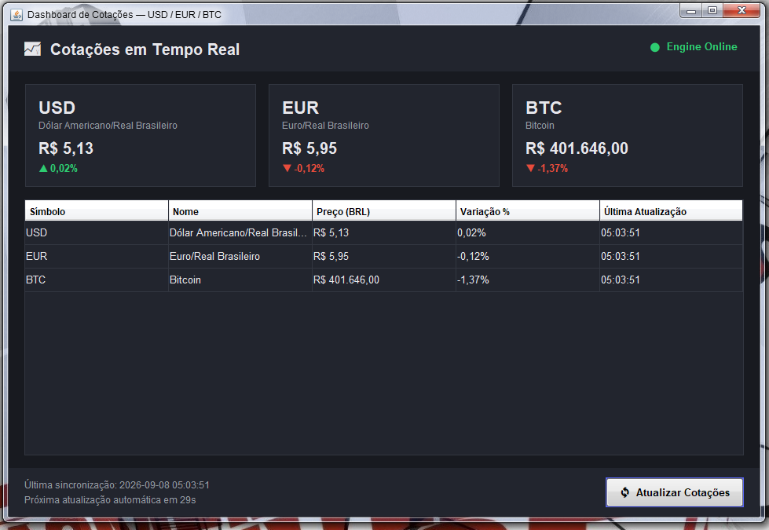
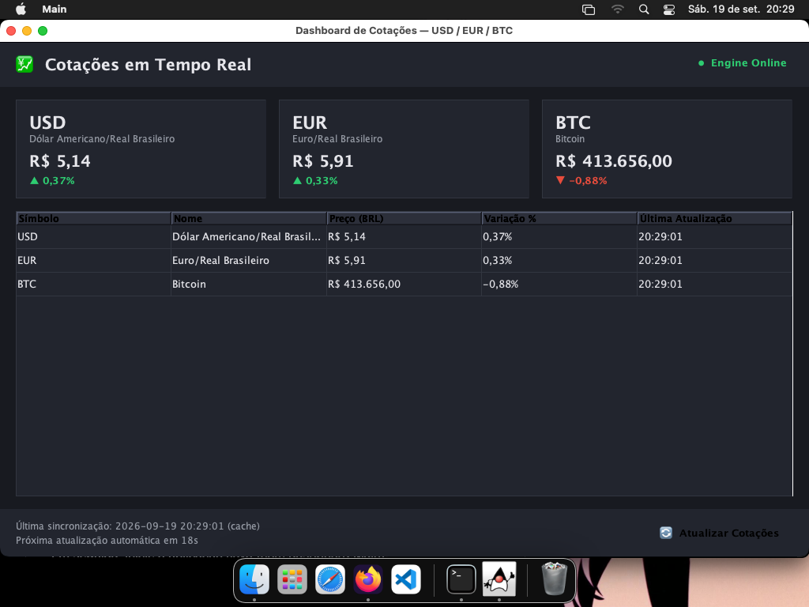
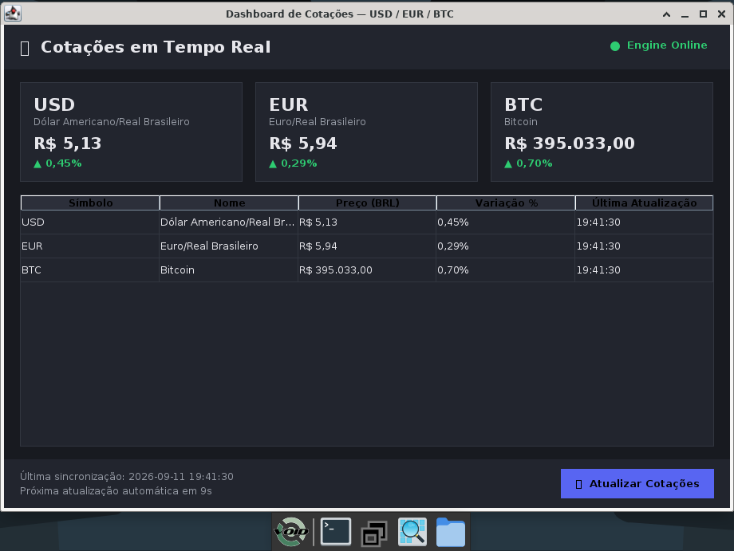

# 💹 RustQuote FX — Real-Time Market Dashboard

**RustQuote FX** é uma aplicação desktop híbrida e de alta performance desenvolvida para o monitoramento em tempo real das principais moedas estrangeiras (**USD**, **EUR**) e criptomoedas (**BTC**) convertidas para BRL.

O projeto utiliza uma **arquitetura híbrida cliente-servidor local**: uma engine em **Rust** responsável pela busca, concorrência e cache dos dados, e uma interface gráfica moderna em **Java Swing** para a renderização não-bloqueante na tela.

---

<div align="center">

  <h2>💻 Compatibilidade Multiplataforma Desktop</h2>
  
 <br>

  <h3>Windows 🪟</h3>
  

  <br><br>

  <h3>MacOS 🍎 / Linux 🐧</h3>
  <h3>MacOs</h3>
  
  <br> 
  <h3>Void Linux</h3>
   

</div>


---

## 🏗️ Arquitetura do Sistema
```
┌─────────────────────────┐         GET /api/quotes         ┌─────────────────────────┐
│     Java Swing UI       │ ──────────────────────────────► │    Rust Engine (Axum)   │
│   (RustEngineClient)    │ ◄────────────────────────────── │   Cache 25s + Tokio     │
│  Thread-Safe (SwingWorker)│        JSON Consolidado         │ (AwesomeAPI / CoinGecko)│
└─────────────────────────┘                                 └─────────────────────────┘

```

---

## 🔑 Funcionalidades Principais

* **Arquitetura Híbrida (Rust + Java):** Separação clara entre a lógica de alta performance (backend local) e a interface do usuário (frontend desktop).
* **Processamento Paralelo (Rust):** Busca simultânea de dados na AwesomeAPI e CoinGecko usando `tokio::join!`.
* **Sistema de Cache Inteligente (Rust):** Cache de 25 segundos em memória com fallback degradado (se a API externa falhar, a engine retorna a última cotação válida).
* **Interface Assíncrona (Java):** Atualizações de UI executadas via `SwingWorker`, mantendo a interface 100% responsiva.
* **Monitor de Conexão em Tempo Real:** Verificação a cada 5s indicando o status da engine (`Engine Online` / `Engine Offline`).
* **Auto-Refresh Configurável:** Atualização automática das cotações a cada 30 segundos, com contador regressivo e botão de atualização manual.

---

## 🛠️ Tecnologias Utilizadas

### **Backend (Rust Engine)**
* **Rust** (Edição 2021)
* **Axum** — Framework web assíncrono para a API REST local.
* **Tokio** — Runtime assíncrono para requisições paralelas.
* **Serde / Serde JSON** — Serialização e deserialização ultra-rápida de JSON.
* **Reqwest** — Cliente HTTP para consumo de APIs externas.

### **Frontend (Java UI)**
* **Java 17+**
* **Java Swing** — Construção da interface gráfica customizada em modo escuro (Dark Theme).
* **Java HTTP Client (`java.net.http`)** — Comunicação nativa com o backend Rust.
* **Gson (Google)** — Parsing do payload JSON retornado pela engine.

---

## 🗂️ Estrutura do Repositório
```
projeto-cotacoes/
├── README.md
├── .gitignore
├── rust-engine/
│   ├── Cargo.toml
│   └── src/
│       └── main.rs
└── java-ui/
├── lib/
│   ├── LEIA-ME.txt          # Instruções para download do Gson
│   └── gson-2.10.1.jar
└── src/
└── com/
└── dashboard/
├── Main.java
├── model/
│   ├── Quote.java
│   └── QuotesResponse.java
├── service/
│   └── RustEngineClient.java
└── view/
└── DashboardFrame.java
```

---

## 🚀 Como Executar o Projeto

### **1. Pré-requisitos**
* **Rust** e **Cargo** instalados ([rustup.rs](https://rustup.rs/))
* **JDK 17 ou superior** instalado
* Arquivo `gson-2.10.1.jar` posicionado na pasta `java-ui/lib/`

---

### **2. Executando a Engine em Rust**

Abra o terminal na pasta raiz do projeto:

```bash
cd rust-engine

cargo run

```

Na primeira execução, o Cargo baixará e compilará as dependências. Ao finalizar, você verá a mensagem:
```
🚀 Rust Engine no ar em http://127.0.0.1:8080
```

Testando a API REST (Opcional):

```Bash
curl http://localhost:8080/api/quotes

```

3. Executando a UI em Java
Abra outro terminal na pasta do projeto:

```Windows (PowerShell):
PowerShell
cd java-ui

# Compilar
javac -cp "lib\gson-2.10.1.jar" -d out (Get-ChildItem -Recurse -Filter *.java -Path src | ForEach-Object { $_.FullName })

# Executar
java -cp "out;lib\gson-2.10.1.jar" com.dashboard.Main

```
Linux / macOS (Terminal):
```Bash
cd java-ui

# Compilar
find src -name "*.java" > sources.txt
javac -cp "lib/gson-2.10.1.jar" -d out @sources.txt

# Executar
java -cp "out:lib/gson-2.10.1.jar" com.dashboard.Main

```
📌 Ordem Recomendada de Execução
Inicie primeiro o backend em Rust (cargo run).

Em seguida, inicie a aplicação Java (com.dashboard.Main).

O indicador de status no topo da janela exibirá Engine Online em verde. Caso a engine seja interrompida, o indicador mudará automaticamente para Engine Offline em vermelho.
